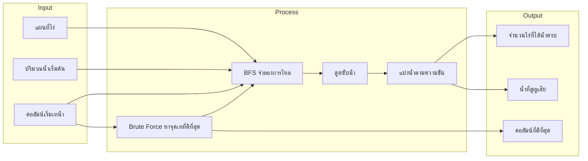
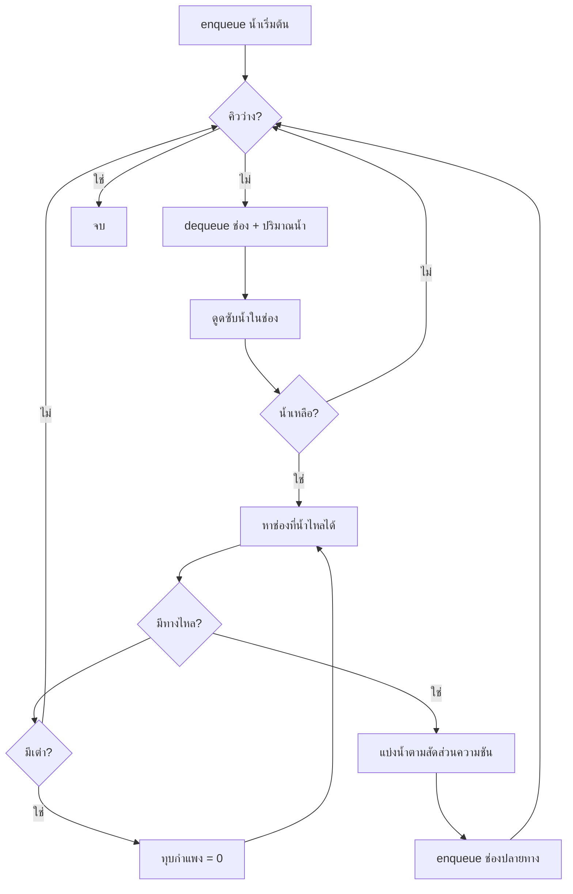

# Tech Tournament #2 Bangkok Bank
## IncanTerraceFlow — จำลองน้ำไหลบนไร่ขั้นบันได

โปรแกรมนี้ **จำลองการไหลของน้ำ** บนไร่ขั้นบันได (Incan Terrace) ที่แบ่งเป็นตารางหลายช่อง แล้วคำนวณว่าไร่ไหนได้น้ำครบ และน้ำสูญเสียเท่าไหร่

---

## โปรแกรมนี้ทำอะไร?

ลองนึกภาพ **ไร่ขั้นบันไดบนภูเขา**:

- แต่ละช่องมี **ความสูงต่างกัน** — น้ำไหลจากที่สูงไปที่ต่ำ
- มี **กำแพง** กั้นบางทิศทาง
- แต่ละช่องต้องการ **น้ำจำนวนหนึ่ง** ถึงจะถือว่า "ได้น้ำครบ"
- บางช่องมี **เต่า** — ถ้าน้ำติดไม่มีทางไป เต่าจะ **ทุบกำแพง** ให้น้ำไหลต่อได้



---

## Input — ข้อมูลเข้า

| ข้อมูล | ความหมาย |
|--------|----------|
| **Elevation** | ความสูงของแต่ละช่อง (เมตร) |
| **Walls** | กำแพงกั้นทิศทาง — bit mask: เหนือ=8, ใต้=2, ตะวันออก=4, ตะวันตก=1 |
| **Absorption** | ปริมาณน้ำที่ช่องต้องการถึงจะ "ครบ" |
| **Tortoise** | มีเต่าหรือไม่ (1=มี) |
| **Initial Water** | น้ำที่เทตอนเริ่ม |
| **Start Column** | เทน้ำที่คอลัมน์ไหนของ **แถวบนสุด** (แถว 0) |

ข้อมูลอ่านจากไฟล์ CSV/JSON ในโฟลเดอร์ `TestCases/` หรือส่งเข้าเป็น array โดยตรง

### ตัวอย่าง CSV (mini_case — 3×3)

```csv
ELEVATION
100,100,100
90,80,70
60,50,40
WALLS
11,10,14
11,0,14
11,10,14
ABSORPTION
50,50,50
50,50,50
50,50,50
TORTOISE
0,0,0
0,1,0
0,0,0
```

---

## อัลกอริทึมที่ใช้ — และทำไมถึงเลือก

โปรแกรมใช้อัลกอริทึมหลัก **2 ชั้น**:

| ชั้น | อัลกอริทึม | ใช้ทำอะไร |
|------|-----------|-----------|
| 1 | **BFS (Breadth-First Search)** | จำลองน้ำไหลจากจุดเท 1 จุด |
| 2 | **Brute Force (ค้นหาแบบลองทุกทาง)** | ลองเทน้ำทุกคอลัมน์ หาจุดที่ได้ไร่ครบมากที่สุด |

---

### ทำไมใช้ BFS จำลองน้ำไหล?

**BFS** = ค้นหาแบบกว้าง — ใช้ **คิว (Queue)** กติกาคือ **ใครเข้าคิวก่อน ออกมาประมวลผลก่อน** (FIFO)

#### ปัญหานี้เป็นแบบไหน?

เมื่อเทน้ำที่ช่องหนึ่ง น้ำจะ:
1. ถูกดูดซับในช่องนั้นก่อน
2. ที่เหลือแยกไหลไปหลายทิศ **พร้อมกัน** (ถ้ามีหลายทางที่ต่ำกว่า)
3. แต่ละทางได้น้ำ **ไม่เท่ากัน** — ทางที่ลาดชันกว่าได้มากกว่า
4. ช่องเดิมอาจได้รับน้ำ **หลายครั้ง** จากคนละทาง

นี่คือปัญหา **การแพร่กระจาย (propagation)** ไม่ใช่ปัญหา **หาเส้นทางสั้นที่สุด**

#### ทำไมไม่ใช้ DFS?

**DFS** (Depth-First Search) จะเจาะลึกทางเดียวก่อน แล้วค่อยย้อนกลับ

```
BFS:  A → B, C พร้อมกัน → แล้วค่อยไป D, E, F
DFS:  A → B → D → ... ลึกมาก ๆ → ค่อยกลับมา C
```

น้ำในชีวิตจริงไหลออกจากช่องหนึ่งไป **หลายทิศพร้อมกัน** ไม่ได้ไหลทางเดียวจนสุดแล้วค่อยกลับมา ดังนั้น BFS เหมาะกว่าเพราะประมวลผลตาม **ลำดับที่น้ำมาถึง** คล้ายคลื่นน้ำที่แผ่ออกทีละชั้น

#### ทำไมไม่ใช้ Dijkstra?

**Dijkstra** ใช้หาเส้นทางที่มี "ต้นทุน" น้อยที่สุดบนกราฟที่ **น้ำหนักขอบ (edge weight) ตายตัว**

แต่ในโปรแกรมนี้:
- น้ำ **แบ่งสัดส่วน** ตามความต่างของความสูง ไม่ใช่เลือกทางเดียว
- ช่องเดิมอาจถูก enqueue **หลายครั้ง** ด้วยปริมาณน้ำต่างกัน
- กราฟ "เปลี่ยน" ได้เมื่อเต่าทุบกำแพง

จึงไม่ใช่ shortest-path problem แบบคลassic — **BFS + จำลองทีละชิ้นน้ำ** ตรงกับ physics ของปัญหามากกว่า

#### สรุป: เลือก BFS เพราะ

1. น้ำแพร่กระจายตาม **ลำดับเวลาที่มาถึง** → คิว FIFO ตรงกับพฤติกรรมนี้
2. รองรับการ **แยกน้ำหลายทาง** จากช่องเดียว
3. ช่องเดิมรับน้ำซ้ำได้ → enqueue ซ้ำได้โดยไม่ต้อง mark "เคยไปแล้ว"
4. เขียนง่าย อ่านง่าย ทดสอบทีละ step ได้ (`StepNext()`)

---

### โครงสร้างข้อมูลใน BFS

แต่ละรายการในคิวคือ **CellState**:

```
CellState = (แถว, คอลัมน์, ปริมาณน้ำ)
```

เริ่มต้น: enqueue `(0, startColumn, initialWater)`



---

### ขั้นตอนในแต่ละช่อง (SimulationSession)

เมื่อ dequeue ช่อง `(row, col, water)`:

#### 1. ดูดซับน้ำ (Absorption)

```
ที่ยังต้องการ = absorptionRequired[row,col] - absorbed[row,col]
ดูดได้ = min(น้ำที่มี, ที่ยังต้องการ)
absorbed[row,col] += ดูดได้
น้ำที่เหลือ -= ดูดได้
```

#### 2. หาทางไหล (FindFlowTargets)

มอง 4 ทิศ: เหนือ, ใต้, ตะวันออก, ตะวันตก

| เงื่อนไข | ผล |
|----------|-----|
| มีกำแพงกั้นทิศนั้น | ข้าม |
| ขอบแผนที่ (นอก grid) | น้ำ **ตกหน้าผา** → นับเป็น Water Loss |
| ช่องข้าง ๆ **ต่ำกว่า** | ไหลได้ — บันทึก `heightDiff = ความสูงปัจจุบัน - ความสูงเพื่อนบ้าน` |
| ช่องข้าง ๆ สูงเท่ากันหรือสูงกว่า | ไหลไม่ได้ |

#### 3. เต่าทุบกำแพง

ถ้า **ไม่มีทางไหลเลย** แต่ `hasTortoise[row,col] = true`:
- ตั้ง `walls[row,col] = 0` (ลบกำแพงทุกทิศ)
- หาทางไหลใหม่

#### 4. แบ่งน้ำตามสัดส่วนความชัน (Proportional Splitting)

ถ้ามีหลายทางไหล น้ำที่เหลือแบ่งตาม **สัดส่วนความต่างของความสูง**:

```
totalDiff = ผลรวม heightDiff ของทุกทาง
share_i = น้ำที่เหลือ × (heightDiff_i / totalDiff)
```

**ตัวอย่าง:** น้ำเหลือ 60 หน่วย, ทางซ้ายต่าง 10, ทางขวาต่าง 20
- ซ้าย: 60 × (10/30) = **20**
- ขวา: 60 × (20/30) = **40**

ทางที่ลาดชันกว่า (ต่างความสูงมากกว่า) ได้น้ำมากกว่า — เหมือนน้ำไหลลงทางที่ชันกว่าเร็วกว่า

#### 5. ใส่คิวต่อ

- ถ้าปลายทางอยู่ **ในแผนที่** → enqueue `(targetRow, targetCol, share)`
- ถ้า **ตกหน้าผา** → บวก `share` เข้า `totalWaterLoss`

---

### อัลกอริทึมที่ 2: Brute Force หาจุดเทที่ดีที่สุด

เมื่อต้องการรู้ว่า **เทน้ำคอลัมน์ไหนดีที่สุด** ใช้ **Brute Force**:

```
bestColumn = 0
maxCovered = -∞

for column = 0 ถึง cols-1:
    รัน BFS จำลองจาก (แถว 0, column)
    ถ้า coveredFarms > maxCovered:
        maxCovered = coveredFarms
        bestColumn = column

return (bestColumn, maxCovered)
```

#### ทำไมใช้ Brute Force?

- จุดเริ่มเทมีแค่ **คอลัมน์บนแถวแรก** = มี `cols` ทางเลือก (เช่น 6 ทาง)
- แต่ละทางเลือกต้อง **รันจำลองเต็มรอบ** ถึงจะรู้ผล
- ไม่มีสูตรคำนวณตรง ๆ ว่าคอลัมน์ไหนดีที่สุด เพราะผลขึ้นกับความสูง กำแพง การแบ่งน้ำ และเต่า
- `cols` มักน้อย → ลองครบทุกคอลัมน์ **เร็วพอ** และ **ได้ผลถูกต้องแน่นอน**

#### ความซับซ้อน (โดยประมาณ)

| ส่วน | ความซับซ้อน |
|------|-------------|
| BFS จำลอง 1 ครั้ง | O(K) — K = จำนวนครั้งที่ dequeue (ขึ้นกับการแยกน้ำและจำนวนช่อง) |
| Brute Force หาจุดเท | O(cols × K) |
| ช่องเดิมเข้าคิวซ้ำได้ | K อาจมากกว่า rows×cols |

---

## Output — ผลลัพธ์

| ผลลัพธ์ | ความหมาย |
|---------|----------|
| **CoveredCount** | จำนวนช่องที่ `absorbed ≈ absorptionRequired` |
| **TotalWaterLoss** | น้ำที่ไหลออกนอกแผนที่ (ตกหน้าผา) |
| **Absorbed** | ตาราง 2D ว่าแต่ละช่องได้น้ำเท่าไหร่ |
| **BestStartColumn** | คอลัมน์ที่ให้ CoveredCount สูงสุด |
| **OperationsProcessed** | จำนวนครั้งที่ dequeue (ใช้วัด workload) |

---

## ตัวอย่างการทำงาน

### ตัวอย่างที่ 1 — น้ำไหลลงช่องเดียว

```
A (100m, ต้องการ 50)  →  B (90m, ต้องการ 50)
เทน้ำ 200 ที่ A
```

1. A ดูด 50 → เหลือ 150
2. 150 ไหลไป B (B ต่ำกว่า)
3. B ดูด 50 → **CoveredCount = 2**

### ตัวอย่างที่ 2 — แบ่งน้ำ 2 ทาง

```
ซ้าย (90m)  ←  กลาง (100m)  →  ขวา (80m)
เทน้ำ 110 ที่กลาง, แต่ละช่องต้องการ 50
```

1. กลาง ดูด 50 → เหลือ 60
2. ซ้ายต่าง 10, ขวาต่าง 20 → รวม 30
3. ซ้ายได้ 60×(10/30)=**20**, ขวาได้ 60×(20/30)=**40**

### ตัวอย่างที่ 3 — เต่าทุบกำแพง

```
A ถูกกำแพงล้อม (walls=15) แต่มีเต่า
B อยู่ข้าง ๆ ต่ำกว่า
```

1. น้ำใน A ดูดซับเสร็จ เหลือน้ำแต่ไม่มีทางไหล
2. เต่าทุบ → `walls[A] = 0`
3. หาทางใหม่ → น้ำไหลไป B ได้

---

## ไฟล์ที่เกี่ยวกับอัลกอริทึม

| ไฟล์ | หน้าที่ |
|------|--------|
| `SimulationSession.cs` | BFS หลัก — คิว, ดูดซับ, แบ่งน้ำ, เต่า |
| `IncanTerraceSimulator.cs` | เรียกจำลอง + Brute Force หาคอลัมน์ที่ดีที่สุด |
| `GridDataParser.cs` | อ่าน CSV/JSON เป็น input |
| `GridData.cs` | โครงสร้างข้อมูลแผนที่ |
| `SimulationStep.cs` | บันทึกผลแต่ละ step (สำหรับ step-by-step) |

---

## สรุป

| | |
|---|---|
| **Input** | แผนที่ (ความสูง, กำแพง, absorption, เต่า) + น้ำเริ่มต้น + คอลัมน์เท |
| **Algo หลัก** | **BFS + คิว** — จำลองน้ำแพร่กระจาย, แบ่งตามความชัน |
| **Algo หาจุดเท** | **Brute Force** — ลองทุกคอลัมน์ หา covered สูงสุด |
| **Output** | จำนวนไร่ครบ, น้ำสูญเสีย, ตาราง absorbed, คอลัมน์ที่ดีที่สุด |

**เลือก BFS** เพราะน้ำไหลแบบแพร่กระจายตามลำดับที่มาถึง ไม่ใช่เจาะลึกทางเดียว (DFS) และไม่ใช่หาเส้นทางสั้นสุด (Dijkstra) **เลือก Brute Force** เพราะทางเลือกจุดเทมีน้อย และต้องรันจำลองเต็มรอบถึงจะรู้ผล

---

## วิธีการติดตั้งและรันโปรแกรม (Setup & Running Guide)

### ความต้องการของระบบ (Prerequisites)
1. **ระบบปฏิบัติการ**: Windows (เนื่องจากเป็นแอปพลิเคชัน Windows Forms)
2. **.NET SDK**: ต้องติดตั้ง **.NET SDK 10.0** ขึ้นไป

### ขั้นตอนการรันโปรแกรม
1. เปิด Command Prompt หรือ PowerShell ในโฟลเดอร์ของโปรเจกต์ `IncanTerraceFlow/`
2. ดาวน์โหลดแพ็กเกจและรันโปรแกรมด้วยคำสั่ง:
   ```bash
   dotnet run
   ```
3. หน้าจอ Windows Forms จะปรากฏขึ้นมา ให้เลือกข้อมูลนำเข้า (Built-in Cases), ปรับแต่งข้อมูลน้ำเริ่มต้น, และกด **Run Animated** หรือ **Instant Run** เพื่อเริ่มจำลอง

### ขั้นตอนการรันแบบทดสอบ (Unit Tests)
คุณสามารถรัน unit tests ทั้งหมดของระบบ (รวม 30 เคส) ได้โดยใช้คำสั่ง:
```bash
dotnet test IncanTerraceFlow.Tests/IncanTerraceFlow.Tests.csproj
```

